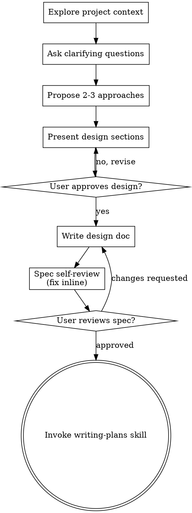

# 将想法脑暴为设计

通过自然的协作对话，帮助把想法转化为完整的设计与规格说明。

首先理解当前项目上下文，然后每次提出一个问题来细化想法。一旦理解了要构建的内容，就呈现设计方案并获取用户认可。

<HARD-GATE>
在呈现设计方案并获得用户认可之前，不要调用任何实现类 skill、不要编写任何代码、不要搭建任何项目、也不要采取任何实现动作。这适用于所有项目，无论看起来多么简单。
</HARD-GATE>

## 反模式："这个太简单了，不需要设计"

每个项目都要经历这个过程。待办清单、单函数工具、配置变更——全部都需要。所谓"简单"的项目，正是那些未经审视的假设造成最多返工的地方。设计可以很短（真正简单的项目只需几句话），但你必须呈现它并获得认可。

## 检查清单

你必须为以下每一项创建任务，并按顺序完成：

1. **探索项目上下文** — 检查文件、文档、最近的提交
2. **适时提供可视化助手** — 不要一开始就提供。当某个问题确实"看得见比说得清"时，再首次提出（单独一条消息）；用户同意后，浏览器标签页会为你打开。如果始终没有出现视觉性问题，就不要提供。详见下方的 Visual Companion 部分。
3. **提出澄清问题** — 一次一个，理解目的/约束/成功标准
4. **提出 2-3 种方案** — 附带权衡分析和你推荐的方案
5. **呈现设计** — 按复杂度分节展示，每节结束后获得用户认可
6. **撰写设计文档** — 保存到 `docs/superpowers/specs/YYYY-MM-DD-<topic>-design.md`(`YYYY-MM-DD`是当前日期) 并提交
7. **规格自检** — 快速检查占位符、矛盾、歧义、范围（见下方）
8. **用户审阅书面规格** — 请用户在继续前审阅规格文件
9. **过渡到实现** — 调用 writing-plans skill 创建实现计划

## 流程图

**终止状态是调用 writing-plans。** 不要调用 frontend-design、mcp-builder 或任何其他实现类 skill。brainstorming 之后唯一调用的 skill 是 writing-plans。

## 流程

**理解想法：**

- 首先检查当前项目状态（文件、文档、最近的提交）
- 在询问细节问题之前，先评估范围：如果请求涉及多个独立的子系统（例如，"构建一个包含聊天、文件存储、计费和分析的平台"），立即指出。不要花时间先去细化一个还需要先拆解的项目。
- 如果项目太大，无法放入单个规格中，帮助用户拆解为子项目：哪些是独立模块、它们如何关联、应该按什么顺序构建？然后按正常设计流程对第一个子项目进行脑暴。每个子项目都有自己的规格 → 计划 → 实现周期。
- 对于范围合适的项目，每次一个问题来细化想法
- 尽可能使用选择题，但开放式问题也可以
- 每条消息只问一个问题——如果一个话题需要更多探索，拆成多个问题
- 聚焦理解：目的、约束、成功标准

**探索方案：**

- 提出 2-3 种不同方案并分析权衡
- 以对话方式呈现选项，给出你的推荐和理由
- 先给出推荐方案，并解释原因

**呈现设计：**

- 当你认为已经理解了要构建的内容，就呈现设计
- 每个部分按复杂度伸缩：简单的话几句话，复杂的话 200-300 词
- 每节结束后询问"到目前为止是否正确"
- 覆盖：架构、组件、数据流、错误处理、测试
- 如果某些内容不合理，随时准备回头澄清

**为隔离性和清晰性而设计：**

- 将系统拆分为更小的单元，每个单元职责单一，通过定义良好的接口通信，可独立理解和测试
- 对每个单元，你都应该能回答：它做什么、如何使用、依赖什么？
- 别人能否不读内部实现就理解一个单元？你能否改动内部而不破坏调用方？如果不能，边界需要调整。
- 更小、边界清晰的单元也更容易处理——你能更好地理清一次性可纳入上下文的代码，文件职责聚焦时编辑也更可靠。当一个文件过大时，通常说明它承担了太多职责。

**在现有代码库中工作：**

- 在提出变更前先探索现有结构。遵循已有模式。
- 当现有代码存在问题并影响当前工作时（例如文件过大、边界不清、职责纠缠），把针对性改进纳入设计——就像优秀开发者在维护代码时所做的那样。
- 不要提出无关的重构。始终围绕当前目标。

## 设计完成后

**文档：**

- 将已确认的设计（规格）写入 `docs/superpowers/specs/YYYY-MM-DD-<topic>-design.md`
  - （用户对规格位置的偏好优先于此默认路径）
- 如果可用，使用 elements-of-style:writing-clearly-and-concisely skill
- 将设计文档提交到 git

**规格自检：**
撰写规格文档后，用新的视角审视：

1. **占位符扫描：** 是否有 "TBD"、"TODO"、未完成章节或模糊需求？修复它们。
2. **内部一致性：** 各章节是否相互矛盾？架构是否与功能描述匹配？
3. **范围检查：** 是否足够聚焦以放入单个实现计划，还是需要进一步拆解？
4. **歧义检查：** 任何需求是否可能被两种不同方式理解？如果是，选择一种并明确说明。

直接在文中修复问题。不需要重新审阅——修复后继续。

**用户审阅关卡：**
规格审阅循环通过后，请用户在继续前审阅书面规格：

> "规格已撰写并提交到 `<path>`。请在继续前审阅，如需修改请告诉我。"

等待用户回复。如果他们要求修改，就修改并重新运行规格自检循环。只有在用户批准后，才继续下一步。

**实现：**

- 调用 writing-plans skill 创建详细的实现计划
- 不要调用任何其他 skill。下一步就是 writing-plans。

## 核心原则

- **一次只问一个问题** — 不要让用户被多个问题淹没
- **优先使用选择题** — 可能时比开放式问题更容易回答
- **无情地 YAGNI** — 从所有设计中移除不必要的功能
- **探索替代方案** — 在确定前总是提出 2-3 种方案
- **增量验证** — 呈现设计，获得认可后再推进
- **保持灵活** — 遇到不合理的地方，回头澄清

## Visual Companion

一个基于浏览器的可视化助手，用于在脑暴过程中展示原型图、图表和视觉选项。它以工具形式提供——不是模式。接受该助手意味着在适合可视化的问题中可以使用它；并不等于每个问题都要通过浏览器。

**提供可视化助手（适时）：** 不要一开始就说。等到某个问题确实"看得见比说得清"——是真正的原型/布局/图表问题，而不仅仅是 UI 话题。首次出现时单独一条消息提出：
> "这部分如果我展示出来可能更容易理解——我可以在浏览器标签页里随时整理原型图、图表和对比。它还处于早期，token 消耗可能较高。需要我打开吗？我会帮你自动打开。"

**这条邀请必须单独成消息。** 只有邀请本身——不要带澄清问题、总结或其他内容。等待用户回复。如果他们同意，用 `--open` 启动服务器，浏览器会自动打开第一个页面。如果他们拒绝，就继续纯文本对话，除非用户主动提起，否则不再邀请。

**每个问题单独决策：** 即使用户接受了，也要**为每个问题**决定是用浏览器还是终端。判断标准：**用户是看到比读到更理解？**

- **用浏览器** 展示本身就是视觉的内容——原型图、线框图、布局对比、架构图、并排视觉设计
- **用终端** 展示文本内容——需求问题、概念选择、权衡列表、A/B/C/D 文本选项、范围决策

一个关于 UI 话题的问题不一定是视觉问题。"在这个上下文中 personality 是什么意思？"是概念问题——用终端。"哪个向导布局更好？"是视觉问题——用浏览器。

如果用户同意使用可视化助手，在继续前阅读详细指南：
`skills/brainstorming/visual-companion.md`
