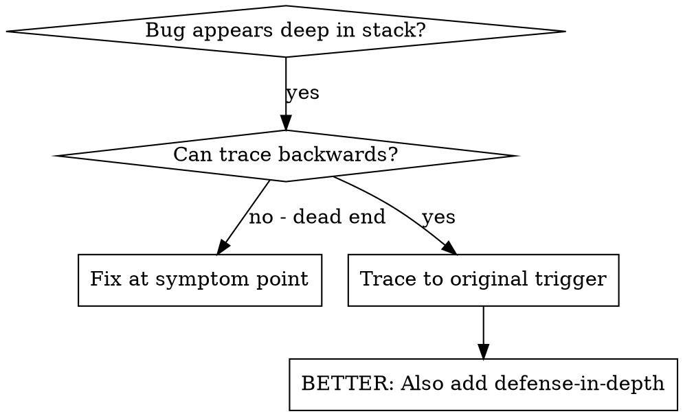
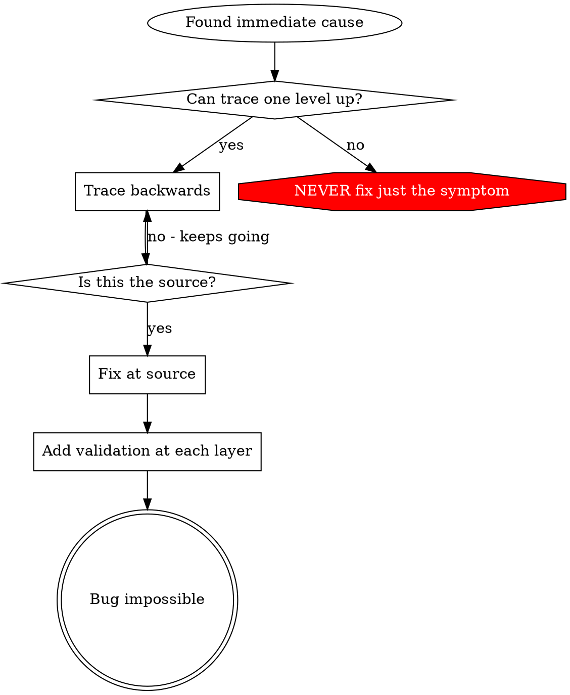

# 根本原因追踪（servergo 项目版）

## 概述

在 servergo 这类多进程、Actor 模型的游戏服务器中，Bug 往往不会直接出现在报错的位置：
- Gate 路由分发失败，根源可能是游戏节点没有注册自定义路由
- 结算后玩家资产不对，根源可能是 `clubCode` 误当作用户维度，或输赢分数符号搞反
- 牌桌卡在 `Playing` 状态，根源可能是 Actor 消息处理函数阻塞
- `tabledesk` 数据不同步，根源可能是异步任务中访问了未复制的 Table 状态
- 配置读取错误，根源可能是 etcd 路径层级拼错，或本地 `etc.toml` 覆盖了共享配置

**核心原则：** 沿着调用链反向追踪，跨服务、跨 Actor、跨状态层找到原始触发点，在源头修复。

## 何时使用



**使用场景：**
- 错误发生在服务深处（`game/<name>`、`mesh` 子服务、`tabledesk`），而不是 Gate 入口
- 堆栈显示经过 WebSocket → gRPC/RPCX → Actor 队列 → Redis → Mongo 多层
- 不确定错误数据（空 `roomID`、错 `clubCode`、旧缓存、反的分数）从哪流入
- 需要定位是哪一个测试 / E2E 脚本 / 配置变更触发了问题

## 追踪流程

### 1. 观察症状

示例：`game/laoyancai` 结算后玩家资产未更新，日志显示：
```
Error: ChangeGold failed: insufficient asset, uid=10086, delta=-500
```

### 2. 找到直接原因

**什么代码直接导致了这个问题？**
```go
// internal/game/asset_impl.go
func (l *goldAssetHandler) Settle(ctx context.Context, uid int64, delta int64, reason string) error {
    log.Infof("gold settle start, uid=%d, delta=%d, reason=%s", uid, delta, reason)
    cli, err := assetsclient.NewClient(l.proxy.NewMeshClient)
    if err != nil {
        return err
    }
    _, err = cli.ChangeGold(ctx, &assetspb.ChangeGoldArgs{Uid: uid, Delta: delta, Reason: reason})
    return err
}
```
直接原因：`ChangeGold` 返回余额不足。

### 3. 追问：是谁调用了这里？

```go
goldAssetHandler.Settle(uid, delta, reason)
  → table.Finish(settleFunc)                // internal/game/table.go:517
  → tableLogic.OnGameOver()                 // game/laoyancai/app/logic/table_logic.go
  → Room/Table Actor 消息处理 goroutine
  → 客户端发送 EndRound 协议到 Gate
```

### 4. 持续向上追踪

**传入了什么值？**
- `delta = -500`，但玩家本局赢了 `+500`
- 符号反了！
- 继续追踪：`delta` 从 `PlayerResult.Score` 计算而来
- 在 `laoyancai` 中可能把输赢分数直接传成了负数

### 5. 找到原始触发点

```go
// game/laoyancai/app/logic/table_logic.go（示意）
results[i] = gamefw.PlayerResult{
    UID:   p.uid,
    Score: -p.winScore, // 错误：本局赢家应为正数
}
```

**根本原因：** 子游戏构造 `PlayerResult` 时符号约定混乱。

**修复：** 在子游戏中统一“赢正输负”的符号约定，并在 `table.Finish` 前增加断言校验。

## 添加堆栈跟踪

当你无法手动追踪时，在关键边界添加探针。

```go
package main

import (
    "context"
    "fmt"
    "os"
    "runtime/debug"

    "github.com/dobyte/due/v2/log"
)

// 在危险操作之前记录上下文与堆栈
func debugSettle(ctx context.Context, uid int64, delta int64, reason string) error {
    stack := debug.Stack()
    log.Errorf("DEBUG settle: uid=%d delta=%d reason=%s stack=%s", uid, delta, reason, stack)

    // 实际业务调用
    return doSettle(ctx, uid, delta, reason)
}
```

**关键：**
- 在测试中使用 `fmt.Fprintf(os.Stderr, ...)` 或 `log.Errorf`——标准输出可能被缓冲/隐藏
- 在 Actor 消息入口、RPC 调用前、Redis/Mongo 读写前加探针
- 包含完整上下文：`tableID`、`round`、`uid`、`clubCode`、当前配置版本

**运行并捕获：**
```bash
# PowerShell
$env:DUE_ETC='.\internal\share\etc\etc.toml'; go test ./game/laoyancai/... 2>&1 | Select-String 'DEBUG settle'

# Git Bash
DUE_ETC=./internal/share/etc/etc.toml go test ./game/laoyancai/... 2>&1 | grep 'DEBUG settle'
```

**分析堆栈跟踪：**
- 查找 `game/<name>/app/logic/*.go` 中的触发行号
- 查找 `internal/game/table.go` 的 `Finish` / `doOver`
- 检查是否经过 Actor 调度（`actor.AfterInvoke`）

## 跨服务边界追踪

servergo 的 Bug 经常跨越 Gate → Game → Mesh → Redis/Mongo。在每个边界记录输入输出：

```bash
# Gate 层：查看 WebSocket 消息路由
# Windows PowerShell
grep "route=" gate/log/due.log | tail -20

# Game 层：查看 Actor 消息处理
grep "table finish start" game/laoyancai/log/due.log

# Mesh 层：查看资产/结算 RPC
grep "gold settle" mesh/log/due.log

# Redis：检查锁与缓存
redis-cli -h 192.168.3.4 -n 3 KEYS "*asset*lock*"

# MongoDB：检查牌桌/战绩记录
mongosh 192.168.3.4:27017/servergo --eval 'db.tables.find({tableId: "xxx"}).sort({createTime: -1})'
```

## 找出哪个测试造成了污染

如果测试后 Redis/Mongo 残留数据，导致后续测试失败：

```bash
# 先定位到具体测试包
go test ./game/laoyancai/... -v 2>&1 | grep -E "FAIL|PASS" | head

# 用二分法逐个运行
go test ./game/laoyancai/... -run TestSettlement -count=1

# E2E 多玩家用例
client/runner.exe --case laoyancai/settlement_flow
```

**常见污染源：**
- 测试修改了 etcd 配置未恢复
- 测试创建了俱乐部/房间未清理
- 测试用 `t.Parallel()` 但共享了 Redis DB
- Actor 未正确关闭，残留定时器
- `DUE_ETC` 指向错误，导致测试连到开发数据库

## 真实示例：牌桌卡在 Playing 状态

**症状：** 所有玩家都已离线，但 `tabledesk` 仍显示该桌为 `Playing`，无法被回收。

**追踪链：**
1. `tabledesk` 状态未更新 ← `syncPlayersToDeskAsync` 没有收到最新玩家列表
2. `syncPlayersToDeskAsync` 在 task goroutine 中运行，参数 `players` 由调用方构造
3. 调用方在 `OnLeaveTable` 中直接访问 `t.players`（受 `sync.RWMutex` 保护）
4. `OnLeaveTable` 在 Actor goroutine 中被调用，但里面调用了阻塞的 RPC
5. 该 RPC 超时 → Actor 消息队列阻塞 → 后续 `OnLeaveTable` / `OnStandUp` 全部排队
6. **根本原因：** 在 Actor 消息处理函数中执行同步 RPC

**修复：** 将 RPC 调用改为异步任务（如 `task.AddTask`），Actor 内只修改状态。

**纵深防御：**
- 第 1 层：在 `TableLifecycle` 回调中禁止直接 RPC，统一走 task 异步
- 第 2 层：`syncPlayersToDeskAsync` 参数快照化，避免访问 Table 状态
- 第 3 层：增加 Actor 消息处理耗时监控，超过 100ms 告警
- 第 4 层：tabledesk 增加心跳超时，强制回收长时间无玩家的桌子

## 真实示例：路由未注册

**症状：** 客户端发送协议后 Gate 返回 `route not found`。

**追踪链：**
1. Gate 找不到路由 ← 游戏节点没有注册该 offset 路由
2. 子游戏在 `Init` 中注册了 handler，但 `route` 用了裸值而不是 `WrapRoute`
3. 子游戏 `core.go` 中 `g.mgr.WrapRoute(offset)` 返回 `baseRoute + offset`
4. 某个 handler 里写成了 `g.mgr.BaseRoute() + offset` 或硬编码了错误的基础路由
5. **根本原因：** 路由注册绕过了 `WrapRoute`

**修复：** 所有自定义路由统一通过 `g.mgr.WrapRoute(offset)` 注册。

**纵深防御：**
- 第 1 层：`Manager.WrapRoute` 增加重复/越界校验
- 第 2 层：启动时扫描所有 handler 路由并校验唯一性
- 第 3 层：Gate 收到未知路由时记录完整来源并返回明确错误码

## 真实示例：Redis 锁维度错误

**症状：** 两个不同玩家同时进入同一亲友圈房间，其中一个被锁阻塞。

**追踪链：**
1. 资产服务加锁失败 ← Redis key 为 `asset_lock:{clubCode}`
2. 该锁本应以 `uid` 为维度，却被设计成了以 `clubCode` 为维度
3. 所有俱乐部成员共享同一把锁，导致并发串行
4. **根本原因：** 锁的作用域与数据所有权不一致

**修复：** 将锁 key 改为 `asset_lock:{uid}:{assetType}`。

## 关键原则



**不要只修复错误出现的位置。** 反向追踪，跨服务、跨 Actor、跨状态层找到原始触发点。

## 堆栈跟踪技巧

**在测试中：** 使用 `log.Errorf` 或 `fmt.Fprintf(os.Stderr, ...)` 而不是可能被抑制的 logger
**在 Actor 中：** 在消息处理函数入口记录，因为 Actor 内串行，容易定位时序问题
**在 RPC 调用前：** 记录输入参数，尤其是 `uid`、`clubCode`、`tableID`
**在危险操作前：** `table.Finish`、资产变更、Redis 锁、etcd 配置读取
**捕获堆栈：** `debug.Stack()` 显示完整调用链，包括 Actor 调度层级

## 常用调试入口

| 问题类型 | 查看位置 | 常用命令 |
|---------|---------|---------|
| 路由/协议 | Gate 日志 + 子游戏 `core.go` | `grep "route not found" gate/log/due.log` |
| 牌桌生命周期 | `internal/game/table.go` + 子游戏 `table_logic.go` | `grep "table finish" game/<name>/log/due.log` |
| 资产/结算 | `internal/game/asset_impl.go` + `internal/service/settlement` | `grep -E "gold settle|score settle" mesh/log/due.log` |
| 玩家状态同步 | `internal/game/table.go:syncPlayersToDeskAsync` | `grep "syncPlayersToDesk" tabledesk/log/due.log` |
| 配置异常 | `etc.toml` / etcd `/config` | `etcdctl get /config --prefix` |
| 测试污染 | 测试日志 + Redis/Mongo | `redis-cli -h 192.168.3.4 FLUSHDB`（仅本地测试） |

## 实际影响

来自 servergo 调试实践：
- 通过 4 层追踪（Gate → Game Actor → Mesh → Mongo）找到结算错误根因
- 在子游戏中修复 `PlayerResult` 符号约定
- 增加 Actor 回调 RPC 禁令与 task 异步化规范
- 避免牌桌状态残留与资产不一致
