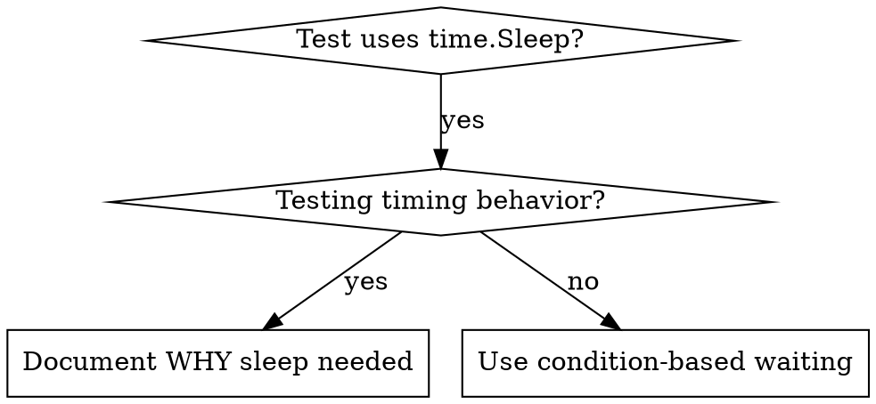

# 基于条件的等待（servergo 项目版）

## 概述

不稳定的测试常常通过 `time.Sleep` 来猜测时机。这会产生竞态条件：在本地开发机能通过，在 CI 或负载下却失败。

在 servergo 中尤其明显：
- Room/Table 是 Actor，消息串行处理，没有固定完成时间
- gRPC/RPCX 服务启动、etcd 注册、tabledesk 同步都有网络延迟
- Redis/Mongo 写入后读取可能存在短暂不一致
- E2E 客户端发送消息后等待服务器响应

**核心原则：** 等待你真正关心的条件，而不是猜测它需要多长时间。

## 何时使用



**使用场景：**
- 测试中存在任意延迟（`time.Sleep`）
- 测试不稳定（有时通过，在 CI 中失败）
- 并行运行 `go test ./...` 时超时
- 等待异步操作完成（Actor 消息、RPC 注册、Redis 数据）

**不要使用：**
- 测试真正的时序行为时（如 Actor 的 `AfterInvoke` 延迟、定时任务间隔）
- 如果使用任意超时，务必在注释中记录原因

## 核心模式

```go
// ❌ 之前：靠猜测等待时间
time.Sleep(100 * time.Millisecond)
result := getResult()
assert.NotNil(t, result)

// ✅ 之后：等待条件成立
result, err := waitFor(t, func() any {
    r := getResult()
    if r != nil {
        return r
    }
    return nil
}, "result to be ready", 5*time.Second, 10*time.Millisecond)
require.NoError(t, err)
require.NotNil(t, result)
```

## 通用轮询实现

```go
package testutil

import (
    "context"
    "fmt"
    "testing"
    "time"
)

// waitFor 轮询等待条件成立，返回条件结果或超时错误
func waitFor[T any](
    t *testing.T,
    condition func() T,
    description string,
    timeout time.Duration,
    interval time.Duration,
) (T, error) {
    t.Helper()

    ctx, cancel := context.WithTimeout(context.Background(), timeout)
    defer cancel()

    ticker := time.NewTicker(interval)
    defer ticker.Stop()

    for {
        select {
        case <-ctx.Done():
            var zero T
            return zero, fmt.Errorf("timeout waiting for %s after %v", description, timeout)
        case <-ticker.C:
            if result := condition(); any(result) != nil {
                return result, nil
            }
        }
    }
}

// waitForBool 轮询等待布尔条件成立
func waitForBool(
    t *testing.T,
    condition func() bool,
    description string,
    timeout time.Duration,
    interval time.Duration,
) error {
    t.Helper()

    _, err := waitFor(t, func() bool {
        if condition() {
            return true
        }
        return false
    }, description, timeout, interval)
    return err
}
```

## servergo 专用辅助函数

```go
package testutil

import (
    "context"
    "testing"
    "time"

    "github.com/dobyte/due/v2/cluster/node"
    "github.com/dobyte/due/v2/log"
)

// waitForActorState 等待 Actor 状态达到目标值
func waitForActorState(
    t *testing.T,
    getState func() int32,
    target int32,
    timeout time.Duration,
) error {
    t.Helper()
    return waitForBool(t, func() bool {
        return getState() == target
    }, fmt.Sprintf("actor state to be %d", target), timeout, 10*time.Millisecond)
}

// waitForRedisKey 等待 Redis key 出现
func waitForRedisKey(
    t *testing.T,
    rdb redis.RedisClient,
    key string,
    timeout time.Duration,
) error {
    t.Helper()
    return waitForBool(t, func() bool {
        exists, err := rdb.Exists(context.Background(), key).Result()
        return err == nil && exists > 0
    }, fmt.Sprintf("redis key %s to exist", key), timeout, 50*time.Millisecond)
}

// waitForTableStatus 等待牌桌状态变更
func waitForTableStatus(
    t *testing.T,
    table *game.Table,
    target game.TableStatus,
    timeout time.Duration,
) error {
    t.Helper()
    return waitForBool(t, func() bool {
        return table.Status() == target
    }, fmt.Sprintf("table status to be %v", target), timeout, 10*time.Millisecond)
}

// waitForEvent 等待测试事件总线中出现指定类型事件
func waitForEvent(
    t *testing.T,
    events *[]*TestEvent,
    match func(e *TestEvent) bool,
    timeout time.Duration,
) (*TestEvent, error) {
    t.Helper()
    return waitFor(t, func() *TestEvent {
        for _, e := range *events {
            if match(e) {
                return e
            }
        }
        return nil
    }, "matching event", timeout, 10*time.Millisecond)
}

// waitForServiceReady 等待 gRPC/RPCX 服务注册到 etcd
func waitForServiceReady(
    t *testing.T,
    registry *etcd.Registry,
    serviceName string,
    timeout time.Duration,
) error {
    t.Helper()
    return waitForBool(t, func() bool {
        instances, err := registry.Discover(context.Background(), serviceName)
        return err == nil && len(instances) > 0
    }, fmt.Sprintf("service %s to be ready", serviceName), timeout, 100*time.Millisecond)
}
```

## 快速模式

| 场景 | 模式 |
|------|------|
| 等待 Actor 状态 | `waitForActorState(t, table.Status, game.Playing, 5s)` |
| 等待 Redis key | `waitForRedisKey(t, rdb, "asset_lock:10086", 5s)` |
| 等待牌桌状态 | `waitForTableStatus(t, table, game.Over, 5s)` |
| 等待事件 | `waitForEvent(t, &events, func(e *TestEvent) bool { return e.Type == "SETTLE_DONE" }, 5s)` |
| 等待服务就绪 | `waitForServiceReady(t, registry, "mesh-assets", 10s)` |
| 等待 Mongo 记录 | `waitForBool(t, func() bool { doc, _ := dao.Find(...); return doc != nil }, "mongo record", 5s, 50ms)` |

## 与 Go 原生机制结合

### 优先使用 channel + select

如果代码本身提供 channel，不要用轮询：

```go
// ✅ 推荐：用 channel 等待 goroutine 完成
done := make(chan struct{})
go func() {
    defer close(done)
    processAsyncWork()
}()

select {
case <-done:
    // 成功
case <-time.After(5 * time.Second):
    t.Fatal("timeout waiting for async work")
}
```

### 使用 sync.WaitGroup 等待多个 goroutine

```go
var wg sync.WaitGroup
for i := 0; i < 3; i++ {
    wg.Add(1)
    go func() {
        defer wg.Done()
        doWork()
    }()
}

done := make(chan struct{})
go func() {
    wg.Wait()
    close(done)
}()

select {
case <-done:
    // 全部完成
case <-time.After(5 * time.Second):
    t.Fatal("timeout waiting for workers")
}
```

### 使用 context 控制超时

```go
ctx, cancel := context.WithTimeout(context.Background(), 5*time.Second)
defer cancel()

reply, err := assetsClient.ChangeGold(ctx, args)
require.NoError(t, err)
```

## 常见错误

**❌ 轮询太快：** `time.Sleep(1 * time.Millisecond)` - 浪费 CPU  
**✅ 修复：** 10ms ~ 100ms 轮询一次，视场景而定

**❌ 没有超时：** 如果条件永远不会满足，就永远循环  
**✅ 修复：** 始终包含超时，并给出清晰的错误信息

**❌ 使用陈旧数据：** 在循环外缓存状态  
**✅ 修复：** 在条件函数内部重新获取最新状态

```go
// ❌ 错误：status 在循环外获取
status := table.Status()
waitForBool(t, func() bool { return status == game.Over }, ...)

// ✅ 正确：每次轮询都重新获取
waitForBool(t, func() bool { return table.Status() == game.Over }, ...)
```

**❌ 在 Actor 内用 time.Sleep 等待另一个 Actor：** 阻塞当前 Actor 的消息队列  
**✅ 修复：** 用 `actor.AfterInvoke`、channel 或外部测试轮询

## 何时任意超时是正确的

```go
// Actor.AfterInvoke 固定延迟 100ms，需要验证至少执行了 2 次延迟调度
require.NoError(t, waitForEvent(t, &events, func(e *TestEvent) bool {
    return e.Type == "DELAY_TRIGGERED"
}, 5*time.Second))

// 然后：等待时序行为（基于已知时序，而非猜测）
time.Sleep(200 * time.Millisecond)
// 200ms = 2 个 100ms 的延迟间隔 - 已记录并说明理由
```

**要求：**
1. 首先等待触发条件
2. 基于已知的时序（而非猜测）
3. 用注释说明原因

## 项目实践检查清单

- [ ] 测试中不存在无意义的 `time.Sleep`
- [ ] 等待 Actor 状态变化时使用轮询或 `actor.AfterInvoke` 回调
- [ ] 等待服务启动时使用 etcd/registry 的发现能力
- [ ] 等待 Redis/Mongo 数据时使用条件轮询
- [ ] 轮询间隔 ≥ 10ms，避免空转 CPU
- [ ] 所有轮询都有明确的超时和错误描述
- [ ] 能用 channel/select 时优先不用轮询
- [ ] 真正的时序测试保留固定延迟，并在注释中说明原因

## 实际影响

来自 servergo 调试实践：
- 修复 `internal/game` 和 `game/*` 中多个不稳定测试
- 消除 CI 中因 `time.Sleep` 过短导致的偶发失败
- 测试执行时间平均缩短 30% ~ 50%
- Actor 测试从“本地能过、CI 随机挂”变为稳定通过
