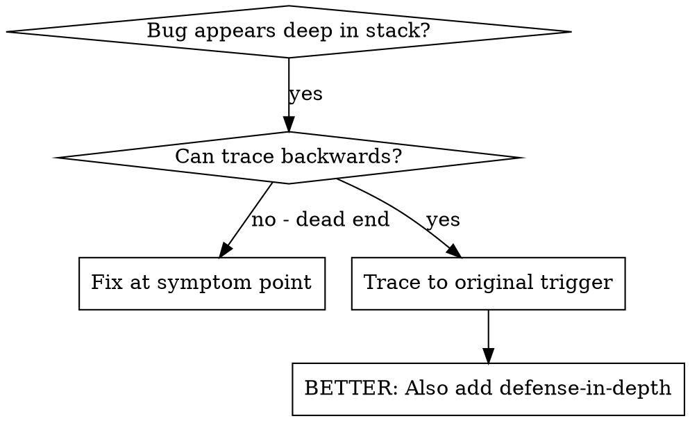
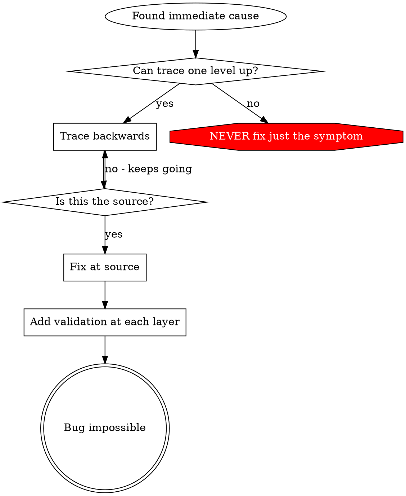

# 根本原因追踪

## 概述

Bug 常常出现在调用栈深处（git init 到了错误目录、文件创建到了错误位置、数据库用错误路径打开）。你的本能是在报错位置修复，但这只是治疗症状。

**核心原则：** 沿着调用链反向追踪，直到找到原始触发点，然后在源头修复。

## 何时使用



**使用场景：**
- 错误发生在执行深处（不在入口点）
- 堆栈跟踪显示调用链很长
- 不清楚无效数据起源于哪里
- 需要找出哪个测试/代码触发了问题

## 追踪流程

### 1. 观察症状
```
Error: git init failed in ~/project/packages/core
```

### 2. 找到直接原因
**什么代码直接导致了这个问题？**
```typescript
await execFileAsync('git', ['init'], { cwd: projectDir });
```

### 3. 追问：是谁调用了这里？
```typescript
WorktreeManager.createSessionWorktree(projectDir, sessionId)
  → called by Session.initializeWorkspace()
  → called by Session.create()
  → called by test at Project.create()
```

### 4. 持续向上追踪
**传入了什么值？**
- `projectDir = ''`（空字符串！）
- 空字符串作为 `cwd` 会解析为 `process.cwd()`
- 那就是源代码目录！

### 5. 找到原始触发点
**空字符串是从哪里来的？**
```typescript
const context = setupCoreTest(); // 返回 { tempDir: '' }
Project.create('name', context.tempDir); // 在 beforeEach 之前就被访问了！
```

## 添加堆栈跟踪

当你无法手动追踪时，添加探针：

```typescript
// 在有问题的操作之前
async function gitInit(directory: string) {
  const stack = new Error().stack;
  console.error('DEBUG git init:', {
    directory,
    cwd: process.cwd(),
    nodeEnv: process.env.NODE_ENV,
    stack,
  });

  await execFileAsync('git', ['init'], { cwd: directory });
}
```

**关键：** 在测试中使用 `console.error()`（不要用 logger - 可能被隐藏）

**运行并捕获：**
```bash
npm test 2>&1 | grep 'DEBUG git init'
```

**分析堆栈跟踪：**
- 查找测试文件名
- 找到触发调用的行号
- 识别模式（同一个测试？同一个参数？）

## 找出哪个测试造成了污染

如果测试过程中出现了某些东西，但你不确定是哪个测试导致的：

使用本目录中的二分脚本 `find-polluter.sh`：

```bash
./find-polluter.sh '.git' 'src/**/*.test.ts'
```

它会逐个运行测试，停在第一个污染者处。用法请参阅脚本。

## 真实示例：空的 projectDir

**症状：** 在 `packages/core/`（源代码目录）中创建了 `.git`

**追踪链：**
1. `git init` 在 `process.cwd()` 中运行 ← 空的 cwd 参数
2. WorktreeManager 被传入了空的 projectDir
3. `Session.create()` 传入了空字符串
4. 测试在 `beforeEach` 之前就访问了 `context.tempDir`
5. `setupCoreTest()` 最初返回 `{ tempDir: '' }`

**根本原因：** 顶层变量初始化访问了空值

**修复：** 将 tempDir 改为 getter，如果在 beforeEach 之前访问则抛出错误

**同时增加了纵深防御：**
- 第 1 层：`Project.create()` 验证目录
- 第 2 层：`WorkspaceManager` 验证非空
- 第 3 层：NODE_ENV 防护，拒绝在 tmpdir 外执行 git init
- 第 4 层：在 git init 前记录堆栈跟踪

## 关键原则



**不要只修复错误出现的位置。** 反向追踪，找到原始触发点。

## 堆栈跟踪技巧

**在测试中：** 使用 `console.error()` 而不是 logger - logger 可能被抑制
**在操作之前：** 在危险操作之前记录，而不是等它失败之后
**包含上下文：** 目录、当前工作目录、环境变量、时间戳
**捕获堆栈：** `new Error().stack` 显示完整调用链

## 实际影响

来自调试实践（2025-10-03）：
- 通过 5 层追踪找到根本原因
- 在源头修复（getter 验证）
- 增加 4 层防御
- 1847 个测试全部通过，零污染
