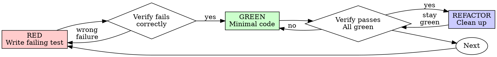

# 测试驱动开发（TDD）

## 概述

先写测试。观察它失败。编写最少量代码让它通过。

**核心原则：** 如果你没有观察过测试失败，你就不知道它是否测试了正确的东西。

**违反规则的字面含义就是违反规则的精神。**

servergo 项目约定：**测试使用真实代码（仅不可避免时用 mock）**。TDD 与这一约定天然契合——它迫使你先思考行为，再思考实现。

## 何时使用

**始终：**
- 新功能
- Bug 修复
- 重构
- 行为变更

**例外（询问你的人类伙伴）：**
- 一次性原型
- 生成的代码（如 `*.pb.go`、`dao/<name>/internal/`）
- 纯配置文件

心想“这次就先跳过 TDD 吧”？停。这是合理化。

## 铁律

```
NO PRODUCTION CODE WITHOUT A FAILING TEST FIRST
```

先写代码再写测试？删掉它。重新开始。

**没有例外：**
- 不要把它作为“参考”保留
- 不要在写测试时“适配”它
- 不要看它
- 删除就是删除

完全根据测试重新实现。就这样。

## 红-绿-重构



### RED - 编写失败的测试

编写一个最小测试，展示应该发生什么。

<Good>
```go
func TestRetryOperation_RetriesThreeTimes(t *testing.T) {
    attempts := 0
    operation := func() (string, error) {
        attempts++
        if attempts < 3 {
            return "", errors.New("fail")
        }
        return "success", nil
    }

    result, err := retryOperation(operation)

    require.NoError(t, err)
    require.Equal(t, "success", result)
    require.Equal(t, 3, attempts)
}
```
名称清晰，测试真实行为，只做一件事
</Good>

<Bad>
```go
func TestRetryOperation(t *testing.T) {
    mockFn := &mockOperation{}
    mockFn.On("Call").Return("", errors.New("fail")).Once()
    mockFn.On("Call").Return("", errors.New("fail")).Once()
    mockFn.On("Call").Return("success", nil).Once()

    retryOperation(mockFn.Call)

    mockFn.AssertNumberOfCalls(t, "Call", 3)
}
```
名称模糊，测试的是 mock 而不是代码
</Bad>

**要求：**
- 一个行为
- 名称清晰
- 真实代码（除非不可避免，否则不要使用 mock）

### Verify RED - 观察它失败

**强制。绝不跳过。**

```bash
# 单个测试
DUE_ETC=./internal/share/etc/etc.toml go test ./internal/common/retry -run TestRetryOperation_RetriesThreeTimes -v

# 单个包
DUE_ETC=./internal/share/etc/etc.toml go test ./internal/common/retry -v
```

确认：
- 测试失败（不是报错）
- 失败信息符合预期
- 失败是因为功能缺失（不是拼写错误）

**测试通过了？** 你在测试已有行为。修正测试。

**测试报错了？** 修复错误，重新运行直到它正确失败。

### GREEN - 最少量代码

编写最简单的代码让测试通过。

<Good>
```go
func retryOperation(fn func() (string, error)) (string, error) {
    for i := 0; i < 3; i++ {
        result, err := fn()
        if err == nil {
            return result, nil
        }
        if i == 2 {
            return "", err
        }
    }
    return "", errors.New("unreachable")
}
```
刚好足够通过
</Good>

<Bad>
```go
func retryOperation(
    fn func() (string, error),
    opts ...RetryOption,
) (string, error) {
    config := defaultConfig()
    for _, opt := range opts {
        opt.apply(config)
    }
    // 支持 maxRetries、线性/指数退避、onRetry 回调……
    // YAGNI
}
```
过度设计
</Bad>

不要添加功能，不要重构其他代码，也不要超出测试范围“改进”。

### Verify GREEN - 观察它通过

**强制。**

```bash
DUE_ETC=./internal/share/etc/etc.toml go test ./internal/common/retry -v
```

确认：
- 测试通过
- 其他测试仍然通过
- 输出干净（没有错误、警告）

**测试失败了？** 修复代码，而不是测试。

**其他测试失败了？** 立即修复。

### REFACTOR - 清理

只在变绿之后：
- 消除重复
- 改进命名
- 提取辅助函数

保持测试绿色。不要添加行为。

### 重复

为下一个功能编写下一个失败测试。

## 好测试

| 质量 | 好 | 差 |
|---------|------|-----|
| **最小化** | 一件事。名称里出现“And”？拆分。 | `func TestValidateEmailAndDomainAndWhitespace(t *testing.T)` |
| **清晰** | 名称描述行为 | `func Test1(t *testing.T)` |
| **展示意图** | 展示期望的 API | 掩盖代码应该做什么 |

### Go 中的表驱动测试

当同一行为有多组输入时，使用表驱动测试：

```go
func TestSubmitForm_ValidatesEmail(t *testing.T) {
    tests := []struct {
        name    string
        email   string
        wantErr string
    }{
        {"empty email", "", "email required"},
        {"whitespace only", "   ", "email required"},
        {"valid email", "user@example.com", ""},
    }

    for _, tt := range tests {
        t.Run(tt.name, func(t *testing.T) {
            result, err := submitForm(SubmitFormArgs{Email: tt.email})
            if tt.wantErr != "" {
                require.Error(t, err)
                require.Contains(t, err.Error(), tt.wantErr)
            } else {
                require.NoError(t, err)
            }
        })
    }
}
```

## 为什么顺序很重要

**“我写完代码后再写测试来验证它能工作”**

测试在代码之后写会立即通过。立即通过什么也证明不了：
- 可能测试了错误的东西
- 可能测试的是实现，而不是行为
- 可能遗漏了你忘记的边界情况
- 你从没看到它抓住 bug

测试先行迫使你看到测试失败，证明它确实在测试某个东西。

**“我已经手动测试了所有边界情况”**

手动测试是临时性的。你以为你测试了所有东西，但：
- 没有测试记录
- 代码变更后无法重新运行
- 压力下容易忘记情况
- “我试的时候它能工作”≠ 全面

自动化测试是系统性的。它们每次都以相同方式运行。

**“删除 X 小时的工作是浪费”**

沉没成本谬误。时间已经花掉了。你现在面临的选择：
- 删除并用 TDD 重写（再花 X 小时，高置信度）
- 保留它并在之后补测试（30 分钟，低置信度，很可能有 bug）

“浪费”的是保留你无法信任的代码。没有真实测试的可运行代码就是技术债务。

**“TDD 太教条，务实意味着灵活调整”**

TDD 就是务实：
- 在提交前发现 bug（比事后调试更快）
- 防止回归（测试立即捕获破坏）
- 文档化行为（测试展示如何使用代码）
- 赋能重构（自由改动，测试捕获破坏）

“务实”的捷径 = 在生产环境调试 = 更慢。

**“测试后补能达到同样的目标——重要的是精神不是仪式”**

不。测试后补回答的是“这段代码做什么？”测试先行回答的是“这段代码应该做什么？”

测试后补受你的实现偏见影响。你测试的是你构建的东西，而不是需求。你验证的是记得的边界情况，而不是发现的边界情况。

测试先行迫使你在实现前发现边界情况。测试后补验证你是否记得所有情况（你没记得）。

30 分钟的测试后补 ≠ TDD。你得到了覆盖率，却失去了测试有效的证明。

## 常见合理化借口

| 借口 | 现实 |
|--------|---------|
| “太简单了，不需要测试” | 简单代码也会坏。写测试只要 30 秒。 |
| “我后面再测试” | 测试立即通过什么也证明不了。 |
| “测试后补能达到同样的目标” | 测试后补 = “这段代码做什么？”测试先行 = “这段代码应该做什么？” |
| “我已经手动测试过了” | 临时 ≠ 系统。没有记录，无法重跑。 |
| “删除 X 小时的工作是浪费” | 沉没成本谬误。保留未验证代码就是技术债务。 |
| “保留作为参考，先写测试” | 你会去适配它。那就是测试后补。删除就是删除。 |
| “需要先探索一下” | 可以。扔掉探索代码，用 TDD 重新开始。 |
| “测试难写 = 设计不清晰” | 倾听测试。难测试 = 难使用。 |
| “TDD 会拖慢我” | TDD 比调试快。务实 = 测试先行。 |
| “手动测试更快” | 手动不能证明边界情况。每次改动你都要重新测。 |
| “现有代码没有测试” | 你正在改进它。为现有代码补测试。 |

## 危险信号 - 停下并重新开始

- 先写代码后写测试
- 实现之后才写测试
- 测试立即通过
- 无法解释测试为什么失败
- 测试“稍后”再补
- 合理化“就这一次”
- “我已经手动测试过了”
- “测试后补能达到同样目的”
- “重要的是精神不是仪式”
- “保留作为参考”或“适配现有代码”
- “已经花了 X 小时，删除是浪费”
- “TDD 太教条，我在务实”
- “这次情况不同，因为……”

**所有这些都意味着：删除代码。用 TDD 重新开始。**

## 示例：Bug 修复

**Bug：** 空邮箱被接受

**RED**
```go
func TestSubmitForm_RejectsEmptyEmail(t *testing.T) {
    _, err := submitForm(SubmitFormArgs{Email: ""})
    require.Error(t, err)
    require.Contains(t, err.Error(), "email required")
}
```

**Verify RED**
```bash
$ DUE_ETC=./internal/share/etc/etc.toml go test ./internal/common/validate -run TestSubmitForm_RejectsEmptyEmail -v
FAIL: expected error containing "email required", got nil
```

**GREEN**
```go
func submitForm(args SubmitFormArgs) (*SubmitFormResult, error) {
    if strings.TrimSpace(args.Email) == "" {
        return nil, errors.New("email required")
    }
    // ...
}
```

**Verify GREEN**
```bash
$ DUE_ETC=./internal/share/etc/etc.toml go test ./internal/common/validate -run TestSubmitForm_RejectsEmptyEmail -v
PASS
```

**REFACTOR**
如果需要，为多个字段提取验证逻辑。

## 在 servergo 中应用 TDD

### 单元测试

```bash
# 单个测试
DUE_ETC=./internal/share/etc/etc.toml go test ./internal/game -run TestTableFinish -v

# 单个包
DUE_ETC=./internal/share/etc/etc.toml go test ./internal/game -v

# 全部内部包
DUE_ETC=./internal/share/etc/etc.toml go test ./internal/...
```

### E2E 测试

```bash
# 多玩家用例
client/runner.exe --case laoyancai/settlement_flow

# 单玩家 Lua 脚本
client/client.exe --script client/script/cases/test_smoke.lua --gateUrl ws://127.0.0.1:3533
```

### TDD 流程示例：修复结算分数错误

```bash
# 1. RED：写失败测试
go test ./game/laoyancai/... -run TestSettlement_WinningPlayerReceivesPositiveScore -v
# → FAIL

# 2. GREEN：修复子游戏中的分数符号
# 修改 game/laoyancai/app/logic/table_logic.go

go test ./game/laoyancai/... -run TestSettlement_WinningPlayerReceivesPositiveScore -v
# → PASS

# 3. REFACTOR：提取结算结果构造辅助函数，保持绿色

go test ./game/laoyancai/... -v
# → PASS

# 4. E2E 验证
client/runner.exe --case laoyancai/settlement_flow
```

## 验证清单

在标记工作完成之前：

- [ ] 每个新函数/方法都有测试
- [ ] 实现前观察了每个测试失败
- [ ] 每个测试都因预期原因失败（功能缺失，不是拼写错误）
- [ ] 为每个测试编写了最少量通过代码
- [ ] 所有测试通过
- [ ] 输出干净（没有错误、警告）
- [ ] 测试使用真实代码（仅在不可避免时使用 mock）
- [ ] 覆盖边界情况和错误情况
- [ ] E2E 用例覆盖关键流程（如适用）

无法勾选所有项？你跳过了 TDD。重新开始。

## 卡住时

| 问题 | 解决方案 |
|---------|----------|
| 不知道如何测试 | 写下期望的 API。先写断言。询问你的人类伙伴。 |
| 测试太复杂 | 设计太复杂。简化接口。 |
| 必须 mock 所有东西 | 代码耦合太重。使用依赖注入。 |
| 测试 setup 巨大 | 提取辅助函数。仍然复杂？简化设计。 |
| Actor 测试难写 | 用真实 Table/Room，通过公开生命周期方法驱动状态。 |
| 需要基础设施 | 启动本地 etcd/Redis/Mongo/NATS，使用测试专用 DB/集合。 |

## 调试集成

发现 bug？编写一个能复现它的失败测试。遵循 TDD 循环。测试既能证明修复，又能防止回归。

永远不要在没有测试的情况下修复 bug。

## 测试反模式

添加 mock 或测试工具时，阅读 [testing-anti-patterns-go.md](testing-anti-patterns-go.md) 以避免常见陷阱：
- 测试 mock 行为而不是真实行为
- 向生产类添加仅测试用的方法
- 在不理解依赖的情况下 mock

## 最终规则

```
Production code → test exists and failed first
Otherwise → not TDD
```

没有你的人类伙伴的允许，没有例外。
