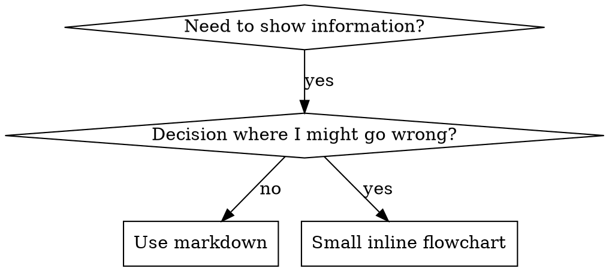

# 编写技能

## 概述

**编写技能，就是将测试驱动开发应用于流程文档。**

**个人技能存放在运行时的 skills 目录中**

你编写测试用例（带压力的子 Agent 场景），观察它们失败（基线行为），编写技能（文档），观察测试通过（Agent 遵循），然后重构（堵住漏洞）。

**核心原则：** 如果你没有观察到 Agent 在没有技能时失败，你就无法确定这个技能教的是否是正确的内容。

**必修背景：** 在使用本技能前，你必须先理解 `superpowers:test-driven-development`。该技能定义了 RED-GREEN-REFACTOR 的基本循环。本技能将 TDD 适配到文档上。

**官方指南：** 关于 Anthropic 官方的 skill 编写最佳实践，请参见 `anthropic-best-practices.md`。该文档提供了额外的模式和指南，与本技能中以 TDD 为核心的方法相互补充。

## 什么是技能？

**技能**是针对成熟技术、模式或工具的参考指南。技能帮助未来的 Agent 找到并应用有效的方法。

**技能是：** 可复用技术、模式、工具、参考指南

**技能不是：** 关于你如何解决某个问题一次性的叙述

## 技能的 TDD 映射

| TDD 概念 | 技能创建 |
|-------------|----------------|
| **测试用例** | 带压力的子 Agent 场景 |
| **生产代码** | 技能文档（SKILL.md） |
| **测试失败（RED）** | Agent 在没有技能时违反规则（基线） |
| **测试通过（GREEN）** | Agent 在有技能时遵循规则 |
| **重构** | 堵住漏洞，同时保持合规 |
| **先写测试** | 在编写技能前先运行基线场景 |
| **观察失败** | 逐字记录 Agent 使用的理由 |
| **最小代码** | 编写针对这些具体违规的技能 |
| **观察通过** | 验证 Agent 现在已遵循 |
| **重构循环** | 发现新理由 → 堵住 → 重新验证 |

整个技能创建过程遵循 RED-GREEN-REFACTOR。

## 何时创建技能

**适合创建：**
- 该技术对你来说并非直觉上显而易见
- 你会在多个项目中再次参考它
- 模式具有广泛适用性（而非特定项目）
- 其他人也能受益

**不要为以下情况创建：**
- 一次性解决方案
- 已有完善文档的标准实践
- 项目特定约定（放在你的 instructions 文件中）
- 机械性约束（如果可以用正则/验证强制，就自动化它——把文档留给需要判断的地方）

## 技能类型

### 技术
具有可遵循步骤的具体方法（condition-based-waiting、root-cause-tracing）

### 模式
思考问题的方式（flatten-with-flags、test-invariants）

### 参考
API 文档、语法指南、工具文档（office 文档）

## 目录结构

```
skills/
  skill-name/
    SKILL.md              # 主要参考（必需）
    supporting-file.*     # 仅在需要时
```

**扁平命名空间** - 所有技能都在一个可搜索的命名空间中

**以下情况使用单独文件：**
1. **厚重参考**（100 行以上）- API 文档、综合语法
2. **可复用工具** - 脚本、工具、模板

**以下情况保持内联：**
- 原则和概念
- 代码模式（< 50 行）
- 其他所有内容

## SKILL.md 结构

**Frontmatter（YAML）：**
- 两个必填字段：`name` 和 `description`（所有支持的字段参见 [agentskills.io/specification](https://agentskills.io/specification)）
- 总计最多 1024 个字符
- `name`：仅使用字母、数字和连字符（无括号、特殊字符）
- `description`：第三人称，仅描述何时使用（不是它做什么）
  - 以 "Use when..." 开头，聚焦触发条件
  - 包含具体症状、情境和上下文
  - **永远不要总结技能的过程或工作流**（原因见 SDO 部分）
  - 尽量控制在 500 字符以内

```markdown
---
name: Skill-Name-With-Hyphens
description: Use when [specific triggering conditions and symptoms]
---

# Skill Name

## Overview
What is this? Core principle in 1-2 sentences.

## When to Use
[Small inline flowchart IF decision non-obvious]

Bullet list with SYMPTOMS and use cases
When NOT to use

## Core Pattern (for techniques/patterns)
Before/after code comparison

## Quick Reference
Table or bullets for scanning common operations

## Implementation
Inline code for simple patterns
Link to file for heavy reference or reusable tools

## Common Mistakes
What goes wrong + fixes

## Real-World Impact (optional)
Concrete results
```

## 技能发现优化（SDO）

**发现至关重要：** 未来的 Agent 需要找到你的技能

### 1. 丰富的 Description 字段

**目的：** Agent 读取 description 来决定是否为当前任务加载某个技能。让它回答：“我现在该不该读这个技能？”

**格式：** 以 "Use when..." 开头，聚焦触发条件

**关键：Description = 何时使用，而不是技能做什么**

Description 应仅描述触发条件。不要总结技能的过程或工作流。

**为什么重要：** 测试发现，当 description 总结工作流时，Agent 可能会按照 description 执行，而不阅读完整技能内容。一个写着 “code review between tasks” 的 description 导致 Agent 只进行了一次审查，即使技能的流程图清楚地显示了两个审查（规范合规，然后代码质量）。

当 description 改为仅 “Use when executing implementation plans with independent tasks”（无工作流总结）时，Agent 正确阅读了流程图并遵循了两阶段审查流程。

**陷阱：** 总结工作流的 description 会成为 Agent 走的捷径。技能正文变成了 Agent 会跳过的文档。

```yaml
# ❌ BAD: Summarizes workflow - agents may follow this instead of reading skill
description: Use when executing plans - dispatches subagent per task with code review between tasks

# ❌ BAD: Too much process detail
description: Use for TDD - write test first, watch it fail, write minimal code, refactor

# ✅ GOOD: Just triggering conditions, no workflow summary
description: Use when executing implementation plans with independent tasks in the current session

# ✅ GOOD: Triggering conditions only
description: Use when implementing any feature or bugfix, before writing implementation code
```

**内容：**
- 使用具体的触发器、症状和情境，表明该技能适用
- 描述*问题*（race conditions、inconsistent behavior），而非*语言特定症状*（setTimeout、sleep）
- 除非技能本身是技术特定的，否则保持触发器与技术无关
- 如果技能是技术特定的，在触发器中明确说明
- 使用第三人称（注入到 system prompt 中）
- **永远不要总结技能的过程或工作流**

```yaml
# ❌ BAD: Too abstract, vague, doesn't include when to use
description: For async testing

# ❌ BAD: First person
description: I can help you with async tests when they're flaky

# ❌ BAD: Mentions technology but skill isn't specific to it
description: Use when tests use setTimeout/sleep and are flaky

# ✅ GOOD: Starts with "Use when", describes problem, no workflow
description: Use when tests have race conditions, timing dependencies, or pass/fail inconsistently

# ✅ GOOD: Technology-specific skill with explicit trigger
description: Use when using React Router and handling authentication redirects
```

### 2. 关键词覆盖

使用 Agent 会搜索的词汇：
- 错误消息：“Hook timed out”、“ENOTEMPTY”、“race condition”
- 症状：“flaky”、“hanging”、“zombie”、“pollution”
- 同义词：“timeout/hang/freeze”、“cleanup/teardown/afterEach”
- 工具：实际命令、库名、文件类型

### 3. 描述性命名

**使用主动语态，动词开头：**
- ✅ `creating-skills` 而不是 `skill-creation`
- ✅ `condition-based-waiting` 而不是 `async-test-helpers`

### 4. Token 效率（关键）

**问题：** getting-started 和频繁引用的技能会在每次对话中加载。每个 token 都很重要。

**目标字数：**
- getting-started 工作流：每个 < 150 词
- 频繁加载的技能：总计 < 200 词
- 其他技能：< 500 词（仍然要简洁）

**技巧：**

**将细节移到工具帮助中：**
```bash
# ❌ BAD: Document all flags in SKILL.md
search-conversations supports --text, --both, --after DATE, --before DATE, --limit N

# ✅ GOOD: Reference --help
search-conversations supports multiple modes and filters. Run --help for details.
```

**使用交叉引用：**
```markdown
# ❌ BAD: Repeat workflow details
When searching, dispatch subagent with template...
[20 lines of repeated instructions]

# ✅ GOOD: Reference other skill
Always use subagents (50-100x context savings). REQUIRED: Use [other-skill-name] for workflow.
```

**压缩示例：**
```markdown
# ❌ BAD: Verbose example (42 words)
your human partner: "How did we handle authentication errors in React Router before?"
You: I'll search past conversations for React Router authentication patterns.
[Dispatch subagent with search query: "React Router authentication error handling 401"]

# ✅ GOOD: Minimal example (20 words)
Partner: "How did we handle auth errors in React Router?"
You: Searching...
[Dispatch subagent → synthesis]
```

**消除冗余：**
- 不要重复交叉引用技能中已有的内容
- 不要解释从命令中显而易见的内容
- 不要包含同一模式的多个示例

**验证：**
```bash
wc -w skills/path/SKILL.md
# getting-started workflows: aim for <150 each
# Other frequently-loaded: aim for <200 total
```

**按你做什么或核心洞察来命名：**
- ✅ `condition-based-waiting` > `async-test-helpers`
- ✅ `using-skills` not `skill-usage`
- ✅ `flatten-with-flags` > `data-structure-refactoring`
- ✅ `root-cause-tracing` > `debugging-techniques`

**动名词（-ing）适合流程：**
- `creating-skills`、`testing-skills`、`debugging-with-logs`
- 主动，描述你正在执行的动作

### 5. 交叉引用其他技能

**当文档引用其他技能时：**

仅使用技能名称，并加上明确要求标记：
- ✅ Good: `**REQUIRED SUB-SKILL:** Use superpowers:test-driven-development`
- ✅ Good: `**REQUIRED BACKGROUND:** You MUST understand superpowers:systematic-debugging`
- ❌ Bad: `See skills/testing/test-driven-development`（不清楚是否必需）
- ❌ Bad: `@skills/testing/test-driven-development/SKILL.md`（强制加载，消耗上下文）

**为什么不要使用 @ 链接：** `@` 语法会立即强制加载文件，在需要之前消耗 200k+ 上下文。

## 流程图使用



**仅在以下情况使用流程图：**
- 非显而易见的决策点
- 可能过早停止的流程循环
- “何时使用 A 而非 B”的决策

**永远不要对以下情况使用流程图：**
- 参考材料 → 表格、列表
- 代码示例 → Markdown 代码块
- 线性指令 → 编号列表
- 无语义意义的标签（step1、helper2）

有关 graphviz 样式规则，请参见本目录中的 `graphviz-conventions.dot`。

**为人类伙伴可视化：** 使用本目录中的 `render-graphs.js` 将技能的流程图渲染为 SVG：
```bash
./render-graphs.js ../some-skill           # 每张图单独输出
./render-graphs.js ../some-skill --combine # 所有图合并为一个 SVG
```

## 代码示例

**一个优秀示例胜过多个平庸示例**

选择最相关的语言：
- 测试技术 → TypeScript/JavaScript
- 系统调试 → Shell/Python
- 数据处理 → Python

**好的示例：**
- 完整且可运行
- 注释充分，解释 WHY
- 来自真实场景
- 清晰展示模式
- 易于改编（而非通用模板）

**不要：**
- 用 5 种以上语言实现
- 创建填空模板
- 写牵强的示例

你很擅长移植——一个优秀示例就足够了。

## 文件组织

### 自包含技能
```
defense-in-depth/
  SKILL.md    # 所有内容内联
```
何时：所有内容都能放下，不需要厚重参考

### 带可复用工具的技能
```
condition-based-waiting/
  SKILL.md    # 概述 + 模式
  example.ts  # 可改编的工作辅助代码
```
何时：工具是可复用代码，而非仅叙述

### 带厚重参考的技能
```
pptx/
  SKILL.md       # 概述 + 工作流
  pptxgenjs.md   # 600 行 API 参考
  ooxml.md       # 500 行 XML 结构
  scripts/       # 可执行工具
```
何时：参考材料太大，不适合内联

## 铁律（与 TDD 相同）

```
NO SKILL WITHOUT A FAILING TEST FIRST
```

这适用于**新技能**以及**对现有技能的编辑**。

先写技能再测试？删掉它。重新开始。
未测试就编辑技能？同样是违规。

**没有例外：**
- 不因为“简单补充”
- 不因为“只是加一个章节”
- 不因为“文档更新”
- 不要把未测试的更改当作“参考”保留
- 不要“边跑测试边调整”
- 删除就是删除

**必修背景：** `superpowers:test-driven-development` 技能解释了为什么这很重要。相同原则适用于文档。

## 测试所有技能类型

不同类型的技能需要不同的测试方法：

### 强调纪律的技能（规则/要求）

**示例：** TDD、verification-before-completion、designing-before-coding

**测试方式：**
- 学术问题：他们是否理解规则？
- 压力场景：他们在压力下是否遵循？
- 多重压力组合：时间 + 沉没成本 + 疲惫
- 识别合理化辩解并添加明确对策

**成功标准：** Agent 在最大压力下遵循规则

### 技术型技能（操作指南）

**示例：** condition-based-waiting、root-cause-tracing、defensive-programming

**测试方式：**
- 应用场景：他们能否正确应用技术？
- 变体场景：他们能否处理边界情况？
- 信息缺失测试：指令是否有遗漏？

**成功标准：** Agent 成功将技术应用于新场景

### 模式型技能（心智模型）

**示例：** reducing-complexity、information-hiding 概念

**测试方式：**
- 识别场景：他们是否能识别模式何时适用？
- 应用场景：他们能否使用这个心智模型？
- 反例：他们是否知道何时不适用？

**成功标准：** Agent 正确识别何时/如何应用模式

### 参考型技能（文档/API）

**示例：** API 文档、命令参考、库指南

**测试方式：**
- 检索场景：他们能否找到正确信息？
- 应用场景：他们能否正确使用找到的信息？
- 缺口测试：常见用例是否都被覆盖？

**成功标准：** Agent 找到并正确应用参考信息

## 跳过测试的常见合理化辩解

| 借口 | 现实 |
|--------|---------|
| "Skill is obviously clear" | 对你清楚 ≠ 对其他 Agent 清楚。测试它。 |
| "It's just a reference" | 参考也可能有缺口、章节不清。测试检索。 |
| "Testing is overkill" | 未测试的技能总会有问题。15 分钟测试能省几小时。 |
| "I'll test if problems emerge" | 问题 = Agent 无法使用技能。在部署前测试。 |
| "Too tedious to test" | 测试比在生产中调试坏技能更轻松。 |
| "I'm confident it's good" | 过度自信保证会出问题。还是测试吧。 |
| "Academic review is enough" | 阅读 ≠ 使用。测试应用场景。 |
| "No time to test" | 部署未测试的技能会浪费更多时间 later 修复。 |

**所有这些都意味着：部署前测试。没有例外。**

## 让形式与失败匹配

在编写指导之前，先对基线失败进行分类。能防弹某一种失败的形式，对另一种失败可能明显适得其反。

| 基线失败 | 正确形式 | 错误形式 |
|---|---|---|
| 在压力下跳过/违反规则（明知故犯） | 禁止 + 合理化辩解表 + 红旗（见下方防弹部分） | 温和指导（“prefer...”、“consider...”） |
| 遵循了，但输出形状错误（提示膨胀、判断被埋没、重复规范） | 正面配方或契约：说明输出是什么——包含哪些部分、顺序如何 | 禁止清单（“don't restate”、“never narrate”） |
| 遗漏了已产出内容中的某个必需元素 | 结构性：在他们填写的模板中设置 REQUIRED 字段或槽位 | 模板附近的散文提醒 |
| 行为应取决于某个条件 | 基于可观察谓词的条件（“if the brief exists, reference it”） | 无条件规则 + 豁免条款 |

**为什么禁止性措辞会在塑造问题上适得其反：** 在竞争性激励（“让提示自包含”）下，Agent 会与 “don't X” 讨价还价。在 dispatch-prompt 指导的措辞对比测试中，禁止组明显产生了更多不期望内容（完全分离的分布），甚至比无指导对照组更糟——微观测试你自己的案例，不要想当然，但永远不要默认使用禁止。配方什么都不留给 Agent 商量：输出符合声明的形状就是符合，不符合就是不符合。

**无论你选择哪种形式，规则如下：**
- **不要细微条款。** “Don't X unless it matters” 重新开启了谈判——在措辞测试中，给获胜配方添加单个细微条款就让它从一致变嘈杂。将真实例外表达为基于可观察谓词的独立条件。
- **豁免条款不会缩小范围。** “This limit doesn't apply to code blocks” 仍然会抑制代码块。如果输出的某部分必须豁免，请重构结构使规则无法触及它。

## 让技能防弹，抵御合理化辩解

强调纪律的技能（如 TDD）需要抵抗合理化辩解。Agent 很聪明，会在压力下找漏洞。

**范围：** 本工具包用于纪律失败——Agent 知道规则却在压力下跳过。对于形状错误的输出或遗漏元素，基于禁止的防弹会适得其反；请改用“让形式与失败匹配”中的形式。

**心理学提示：** 理解说服技巧为何有效，有助于你系统地应用它们。参见 `persuasion-principles.md` 了解研究基础（Cialdini, 2021; Meincke et al., 2025），涵盖权威、承诺、稀缺、社会认同和团结原则。

### 明确堵住每个漏洞

不要只陈述规则——禁止具体的变通方法：

<Bad>
```markdown
Write code before test? Delete it.
```
</Bad>

<Good>
```markdown
Write code before test? Delete it. Start over.

**No exceptions:**
- Don't keep it as "reference"
- Don't "adapt" it while writing tests
- Don't look at it
- Delete means delete
```
</Good>

### 处理“精神 vs 字面”争辩

尽早添加基础原则：

```markdown
**Violating the letter of the rules is violating the spirit of the rules.**
```

这能切断整类“我遵循了精神”的合理化辩解。

### 建立合理化辩解表

从基线测试中捕获合理化辩解（见下方测试部分）。每个 Agent 提出的借口都放入表中：

```markdown
| Excuse | Reality |
|--------|---------|
| "Too simple to test" | Simple code breaks. Test takes 30 seconds. |
| "I'll test after" | Tests passing immediately prove nothing. |
| "Tests after achieve same goals" | Tests-after = "what does this do?" Tests-first = "what should this do?" |
```

### 创建红旗列表

让 Agent 在自我辩解时容易自检：

```markdown
## Red Flags - STOP and Start Over

- Code before test
- "I already manually tested it"
- "Tests after achieve the same purpose"
- "It's about spirit not ritual"
- "This is different because..."

**All of these mean: Delete code. Start over with TDD.**
```

### 为违规症状更新 SDO

添加到 description 中：你即将违反规则时的症状：

```yaml
description: use when implementing any feature or bugfix, before writing implementation code
```

## 技能的 RED-GREEN-REFACTOR

遵循 TDD 循环：

### RED：编写失败测试（基线）

在没有技能的情况下运行压力场景。记录确切行为：
- 他们做了什么选择？
- 他们使用了什么理由（原话）？
- 哪些压力触发了违规？

这就是“观察测试失败”——在编写技能之前，你必须看到 Agent 的自然表现。

### GREEN：编写最小技能

编写针对那些具体理由的技能。不要为假想情况添加额外内容。

使用相同场景 WITH 技能运行。Agent 现在应该遵循。

### REFACTOR：堵住漏洞

Agent 找到了新的理由？添加明确对策。重新测试直到防弹。

### 完整场景之前先进行措辞微观测试

完整压力场景运行是最终关卡，但每次迭代都慢且昂贵。先验证措辞本身：

1. **每次调用一个全新上下文样本**——原始 API 调用，或如果你没有 API 访问权限，则用单个子 Agent。System prompt = 指导将所处的真实上下文（完整技能或提示模板，而非孤立指导）；user message = 一个诱导失败的任务。
2. **始终包含无指导对照。** 如果对照组没有表现出失败，那就没有问题需要修复——停止，不要编写指导。
3. **每个变体 5 次以上重复。** 单个样本会说谎。
4. **手动阅读每个被标记的匹配项。** 可以程序打分，但模板回声和引用的反例会伪装成命中；仅靠自动计数会同时夸大失败和成功。
5. **方差是一个指标。** 当指导生效时，重复结果会收敛到相同形状。五次重复出现五种不同解释，说明措辞不具约束力——在增加字数之前先收紧形式。

微观测试验证措辞；它们不能替代纪律型技能的压力场景。

**测试方法论：** 完整方法参见 [testing-skills-with-subagents.md](testing-skills-with-subagents.md)：
- 如何编写压力场景
- 压力类型（时间、沉没成本、权威、疲惫）
- 系统地堵住漏洞
- 元测试技术

## 反模式

### ❌ 叙事示例
"In session 2025-10-03, we found empty projectDir caused..."
**为什么不好：** 太具体，不可复用

### ❌ 多语言稀释
example-js.js, example-py.py, example-go.go
**为什么不好：** 质量平庸，维护负担

### ❌ 流程图中的代码
```dot
step1 [label="import fs"];
step2 [label="read file"];
```
**为什么不好：** 无法复制粘贴，难以阅读

### ❌ 通用标签
helper1, helper2, step3, pattern4
**为什么不好：** 标签应具有语义意义

## STOP：在转向下一个技能之前

**编写任何技能后，你必须 STOP 并完成部署流程。**

**不要：**
- 批量创建多个技能而不测试每个
- 在当前技能验证前转向下一个
- 因为“批量更高效”而跳过测试

**下方的部署清单对 EACH 技能都是强制性的。**

部署未测试的技能 = 部署未测试的代码。这是质量标准的违反。

## 技能创建清单（TDD 适配）

**重要：为下方 EACH 清单项创建 todo。**

**RED 阶段 - 编写失败测试：**
- [ ] 创建压力场景（纪律型技能 3 种以上组合压力）
- [ ] 在没有技能的情况下运行场景——逐字记录基线行为
- [ ] 识别理由/失败中的模式

**GREEN 阶段 - 编写最小技能：**
- [ ] 名称仅使用字母、数字、连字符（无括号/特殊字符）
- [ ] YAML frontmatter 包含必填的 `name` 和 `description` 字段（最多 1024 字符；参见 [spec](https://agentskills.io/specification)）
- [ ] Description 以 "Use when..." 开头，包含具体触发器/症状
- [ ] Description 使用第三人称
- [ ] 全文包含可搜索关键词（错误、症状、工具）
- [ ] 清晰的概述和核心原则
- [ ] 针对 RED 中识别的具体基线失败
- [ ] 指导形式与失败类型匹配（参见“让形式与失败匹配”）
- [ ] 对于行为塑造指导：与无指导对照进行措辞微观测试（5 次以上重复，每个被标记匹配手动阅读）——纯参考型技能不适用
- [ ] 代码内联 OR 链接到单独文件
- [ ] 一个优秀示例（而非多语言）
- [ ] 在有技能的情况下运行场景——验证 Agent 现在遵循

**REFACTOR 阶段 - 堵住漏洞：**
- [ ] 从测试中识别新的合理化辩解
- [ ] 添加明确对策（如果是纪律型技能）
- [ ] 从所有测试迭代中建立合理化辩解表
- [ ] 创建红旗列表
- [ ] 重新测试直到防弹

**质量检查：**
- [ ] 仅在决策非显而易见时使用小型流程图
- [ ] 快速参考表
- [ ] Common mistakes 部分
- [ ] 无叙事性故事
- [ ] 仅在有工具或厚重参考时才使用支持文件

**部署：**
- [ ] 将技能提交到 git 并推送到你的 fork（如果已配置）
- [ ] 如果具有广泛用途，考虑通过 PR 贡献回去

## 发现工作流

未来 Agent 如何找到你的技能：

1. **遇到问题**（“tests are flaky”）
2. **搜索技能**（grep descriptions、浏览分类）
3. **找到 SKILL**（description 匹配）
4. **浏览 overview**（是否相关？）
5. **阅读 patterns**（快速参考表）
6. **加载 example**（仅在实现时）

**为此流程优化**——尽早并频繁地放置可搜索术语。

## 结论

**创建技能就是流程文档的 TDD。**

相同的铁律：没有失败测试，就没有技能。
相同的循环：RED（基线）→ GREEN（编写技能）→ REFACTOR（堵住漏洞）。
相同的收益：更高质量、更少意外、防弹结果。

如果你为代码遵循 TDD，就为技能也遵循它。这是将相同纪律应用于文档。
